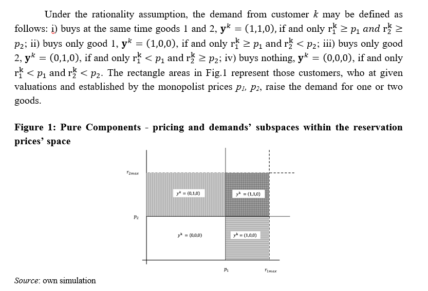
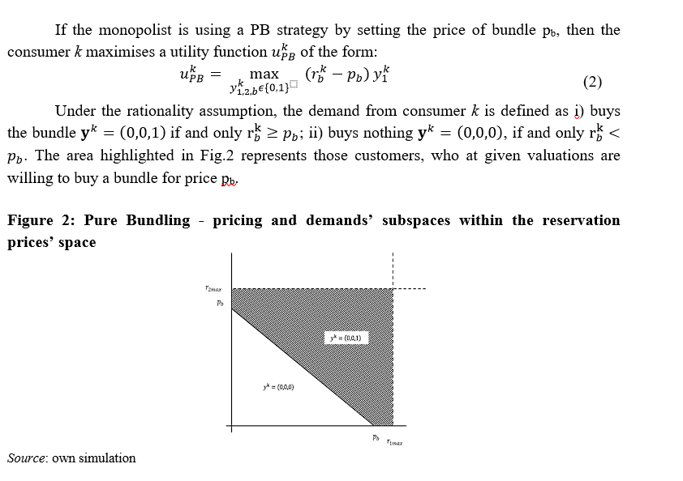
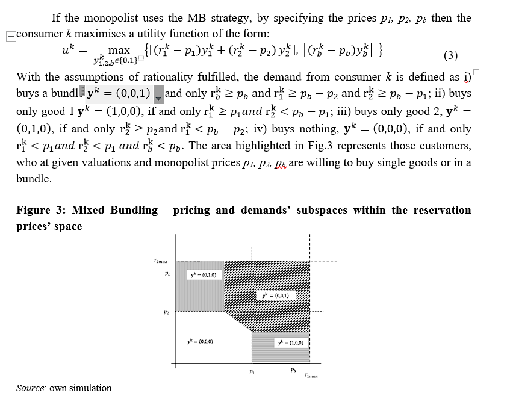

```{r package, include=FALSE}
# 1. loading packages
################ START ############################################
###### Check, installation and loading of required packages #######
requiredPackages = c( "readr", "wesanderson", "flexdashboard","shiny") # list of required packages
for(i in requiredPackages){if(!require(i,character.only = TRUE)) install.packages(i)}
for(i in requiredPackages){if(!require(i,character.only = TRUE)) library(i,character.only = TRUE) } 


library("flexdashboard")
library("wesanderson") 
library("shiny")
library("readr")


data <- read_delim("results-treatment-1.csv",
                     delim = ";", 
                     escape_double = FALSE, 
                     trim_ws = TRUE)


n_rowo <- nrow(data)

pal_col_a <- wes_palette(n = 6,type = "continuous", name="Cavalcanti1")
pal_col_b <- c("Wheat 4","Forest Green","Firebrick", "Turquoise 4"  )

```

0. opis eksperymentu 
=======================================================================

### opis


1.Addtywnosć wycen
=======================================================================

Inputs {.sidebar}
-----------------------------------------------------------------------

```{r eval = TRUE, warning = FALSE, echo = FALSE  }
choice_1 <- as.list(unique(data$nickname))

selectInput("nickname_1",
            label = h3("Nickname"),
            choices = choice_1,
            selected = sample(choice_1,1) 
            )
```


Column 
-----------------------------------------------------------------------

### Test
<h3 style="color: #2e6c80;"><strong>addtywnosć wycen </strong></h3>
<div class="flex flex-grow flex-col max-w-full">
<div class="min-h-[20px] text-message flex flex-col items-start gap-3 whitespace-pre-wrap break-words [.text-message+&amp;]:mt-5 overflow-x-auto" dir="auto" data-message-author-role="assistant" data-message-id="7b7bec8f-cae2-4dc3-8859-1bb4ebbaa552">
<div class="markdown prose w-full break-words dark:prose-invert light">
<p>Addytywność wycen w kontekście d&oacute;br konsumpcyjnych można rozumieć jako założenie, że wartość pakietu (kombinacji) r&oacute;żnych d&oacute;br konsumpcyjnych jest r&oacute;wna sumie wartości poszczeg&oacute;lnych składnik&oacute;w tego pakietu, ocenianych niezależnie. Innymi słowy, wartość konsumpcyjna zestawu produkt&oacute;w nie zmienia się w zależności od tego, czy produkty te są oceniane razem jako część zestawu, czy oddzielnie jako niezależne jednostki.</p>
<p>Przykładowo, jeśli konsument ocenia wartość koszyka zakupowego zawierającego mleko, chleb i ser, addytywność wycen sugeruje, że całkowita wartość użytkowa tego koszyka jest r&oacute;wna sumie wartości użytkowych każdego z tych produkt&oacute;w ocenianych osobno. Taka perspektywa zakłada, że między produktami nie zachodzą żadne interakcje, kt&oacute;re mogłyby zmienić ich łączną wartość percepcyjną, jak synergia czy antysynergia.</p>
<p>W praktyce ekonomicznej i marketingowej często zauważa się jednak, że dobra konsumpcyjne mogą wykazywać nieaddytywne zachowania wycen. Na przykład, promocje typu "kup więcej, zapłać mniej" lub zestawy produkt&oacute;w mogą być postrzegane jako bardziej wartościowe, gdy są sprzedawane razem, niż suma ich wartości sprzedawanych osobno. Tego rodzaju interakcje mogą prowadzić do efekt&oacute;w synergicznych, kt&oacute;re zwiększają wartość całkowitą produkt&oacute;w, gdy są one oferowane jako część pakietu.</p>
</div>
</div>
</div>

OpenAI. (2024). ChatGPT (4) [Large language model]. https://chat.openai.com

### Graph test

```{r echo = FALSE, warning = FALSE, error=FALSE, message=FALSE}
par(mfrow=c(1,1))

renderPlot({
 

nickname <-   input$nickname_1

par(mfrow = c(1, 2))
#nickname <- sample(unique(data$nickname),1) 
# nickname = sample(dane$nickname,1) # test
  
boxplot(as.numeric(data$price_1 ),
        na.rm=TRUE, 
        ylim = c(0,300),
        main = paste0("Wycena Pióra ", nickname) , 
        col = pal_col_a[1])
abline(h = as.numeric(data$price_1[(data$nickname == nickname )]), col = "red")


boxplot(as.numeric(data$price_2 ),
        na.rm=TRUE, 
        ylim = c(0,300),
        main = paste0("Wycena Długopisu ", nickname) , 
        col = pal_col_a[2])
abline(h = as.numeric(data$price_2[(data$nickname == nickname )]), col = "red")


  })
```


Column 
-----------------------------------------------------------------------


### Addytywność 


```{r echo = FALSE, warning = FALSE, error=FALSE, message=FALSE}
par(mfrow=c(1,1))

renderPlot({
 

nickname <-   input$nickname_1

par(mfrow = c(1, 3))

#nickname <- sample(unique(data$nickname),1) 

  

boxplot(as.numeric(data$price_1_2),
        na.rm=TRUE, 
        ylim = c(0,400),
        main = paste0("Wycena Zestawu ", nickname) , 
        col = pal_col_a[3])
abline(h = as.numeric(data$price_1_2[(data$nickname == nickname )]), col = "red")


sep_p1_p2 = as.numeric(data$price_1[(data$nickname == nickname )]) + as.numeric(data$price_2[(data$nickname == nickname )])

boxplot(as.numeric(data$price_1 + data$price_1),
        na.rm=TRUE, 
        ylim = c(0,400),
        main = paste0("Wycena osobno ", nickname) , 
        col = pal_col_a[4])
abline(h = as.numeric(sep_p1_p2), col = "red")


dif_p1_p2 = as.numeric(data$price_1[(data$nickname == nickname )]) + as.numeric(data$price_2[(data$nickname == nickname )]) - as.numeric(data$price_1_2[(data$nickname == nickname )])

boxplot(as.numeric((data$price_1 + data$price_2) - (data$price_1_2)),
        na.rm=TRUE, 
        ylim = c(0,100),
        main = paste0("Wycena osobno ", nickname) , 
        col = pal_col_a[4])
abline(h = as.numeric(dif_p1_p2), col = "red")


  })
```


2.a PC
=======================================================================

Inputs {.sidebar}
-----------------------------------------------------------------------
<h3> Ustalacie niezalezne ceny p1, p2 </p>

<h4><b>Enter your answers:</b></h4>
<p>&nbsp;</p>

P1 - cena pióra:
```{r eval = TRUE, warning = FALSE, echo = FALSE  }
sliderInput("p_1_1", label = "p1:",
            min = 0, max = 250, value = 100, step = 1)

```

P2 - cena długopisu:
```{r eval = TRUE, warning = FALSE, echo = FALSE  }
sliderInput("p_2_1", label = "p2:",
            min = 0, max = 250, value = 100, step = 1)

```


Column 
-----------------------------------------------------------------------

### PC
<h3 style="color: #2e6c80;"><strong> Pure Components </strong></h3>

<div class="flex flex-grow flex-col max-w-full">
<div class="min-h-[20px] text-message flex flex-col items-start gap-3 whitespace-pre-wrap break-words [.text-message+&amp;]:mt-5 overflow-x-auto" dir="auto" data-message-author-role="assistant" data-message-id="729ec860-e4c4-4fce-bc46-7440a699f98a">
<div class="markdown prose w-full break-words dark:prose-invert light">
<p>Strategia cenowa "Pure Components" (Czyste Składniki) to metoda ustalania cen, kt&oacute;ra opiera się na osobnym i niezależnym wycenianiu każdego elementu oferty produktowej lub usługowej. W praktyce oznacza to, że każdy składnik produktu lub usługi jest oferowany i wyceniany osobno, zamiast wchodzić w skład zintegrowanego, nierozłącznego pakietu.</p>
<p><strong>Zalety strategii Pure Components:</strong></p>
<ol>
<li><strong>Przejrzystość cen</strong> &ndash; Klienci widzą dokładnie, za co płacą, co może zwiększać ich zaufanie i zadowolenie z transakcji.</li>
<li><strong>Elastyczność</strong> &ndash; Klienci mogą wybierać tylko te składniki produktu lub usługi, kt&oacute;re są im faktycznie potrzebne, co pozwala na dostosowanie oferty do indywidualnych potrzeb i budżetu.</li>
<li><strong>Optymalizacja koszt&oacute;w dla konsument&oacute;w</strong> &ndash; Brak konieczności płacenia za niechciane elementy pakietu.</li>
</ol>
<p><strong>Wady strategii Pure Components:</strong></p>
<ol>
<li><strong>Potencjalnie wyższe koszty jednostkowe</strong> &ndash; Kiedy produkty lub usługi są sprzedawane oddzielnie, każdy z nich może być wyceniany wyżej, niż gdyby był częścią pakietu.</li>
<li><strong>Skomplikowanie oferty</strong> &ndash; Klienci mogą czuć się przytłoczeni koniecznością samodzielnego wyboru każdego komponentu, co może prowadzić do niezadowolenia lub zaniechania zakupu.</li>
<li><strong>Brak synergii cenowej</strong> &ndash; Klienci nie korzystają z możliwych oszczędności wynikających z kupowania produkt&oacute;w w pakiecie, gdzie często oferowane są zniżki.</li>
</ol>
<p><strong>Zastosowania:</strong> Strategia Pure Components jest często stosowana w branżach, gdzie klientom zależy na wysokiej personalizacji oferty, np. w branży IT (sprzedaż oprogramowania, sprzętu), motoryzacyjnej (konfiguracja samochod&oacute;w) czy usługach telekomunikacyjnych (indywidualne pakiety usług). Przykładem może być możliwość zakupu samochodu, gdzie klient sam decyduje, kt&oacute;re dodatkowe opcje (jak rodzaj tapicerki, systemy audio, dodatkowe pakty bezpieczeństwa) chce dodać do podstawowego modelu.</p>
</div>
</div>
</div>
OpenAI. (2024). ChatGPT (4) [Large language model]. https://chat.openai.com


<table style="border-collapse: collapse; width: 100%;" border="0">
<tbody>
<tr>
<td style="width: 1%;"> </td>
<td style="width: 98%;"></td>
<td style="width: 1%;">&nbsp;</td>
</tr>
</tbody>
</table>

### PC


```{r}

# Lista plików .R do załadowania
pliki <- c("Cost.Bundle.outer.R", 
          "Cost.Bundle.R",       
          "data.R",             
          "Max.Profit.MB.R",     
          "Max.Profit.PB.R",
          "Max.Profit.PC.R",
          "Prices.MB.R",
          "Prices.PB.R",
          "Prices.PC.R",
          "Profit.MB.R",
          "Profit.PB.R",
          "Profit.PC.R",
          "Zero.Profit.MB.R",
          "Zero.Profit.PB.R",
          "Zero.Profit.PC.R")   

# Załaduj każdy plik
for (plik in pliki) {
  source(plik)
}


renderPlot({ 

teta <-  0   # Parameter of degree of contingency of valuations (-) substitutes (+) complementary goods
c.1  <-  0   # Parameter of cost of y1 (MC1 for beta = 0, alfa = 0)
c.2  <-  0   # Parameter of cost of y2 (MC2 for beta = 0, alfa = 0)
beta <-  0   # Parameter of scope economics
alfa <-  0   # Parameter of scale economics
FC   <-  0   # Fix Cost

  

  
r1.r2 <-  cbind(data$price_1,data$price_2)

p.1.max <- max(r1.r2[,1])
p.2.max <- max(r1.r2[,2])
p.b.max <- p.1.max + p.2.max 
p.1.min.max <- c(0,p.1.max)
p.2.min.max <- c(0,p.2.max)
p.b.min.max <- c(0,p.b.max)


par(mfrow=c(1,1))
par(mar=c(4,4,3,1)) 


demand.p.c <- Profit.PC(r1.r2,c(input$p_1_1,input$p_2_1), c.1, c.2, alfa, beta, teta, FC)

####################### drawing of PC ####################### 
plot(r1.r2, type = "p", col="transparent", xlab="r1", ylab="r2", main = paste(" PC","\nProfit = ", round(demand.p.c$profit, 0) , "p1 = ",round(demand.p.c$p.1,2),"p2 = ", round(demand.p.c$p.2,2)) )
points(demand.p.c$no.buy, pch = 8, col = pal_col_b[1])
points(demand.p.c$buy.1, pch = 17, col = pal_col_b[2])
points(demand.p.c$buy.2, pch = 19, col =pal_col_b[3])
points(demand.p.c$buy.1.2, pch = 18, col = pal_col_b[4])
legend("bottomright", col = c("transparent",pal_col_b[1],pal_col_b[2], pal_col_b[3],pal_col_b[4]), pch=c(1,8,17,19,18), legend=c("", "no buy","buy y1", "buy y2" , "buy y1&y2"), bty="n")
abline(h = demand.p.c$p.2, v = demand.p.c$p.1, lty = 2, lwd = 2 , col = "red")

  
  
  }) 

 
```


2.a PB
=======================================================================

Inputs {.sidebar}
-----------------------------------------------------------------------
<h3> Ustalacie cenę zestawu pb </p>

<h4><b>Enter your answers:</b></h4>

```{r eval = TRUE, warning = FALSE, echo = FALSE  }
sliderInput("p_b_1", label = "pb:",
            min = 0, max = 250, value = 200, step = 1)

```


Column 
-----------------------------------------------------------------------

### PB
<h3 style="color: #2e6c80;"><strong> Pure Bundling </strong></h3>
<div class="flex flex-grow flex-col max-w-full">
<div class="min-h-[20px] text-message flex flex-col items-start gap-3 whitespace-pre-wrap break-words [.text-message+&amp;]:mt-5 overflow-x-auto" dir="auto" data-message-author-role="assistant" data-message-id="89476c54-b014-453d-83a4-3973de4015d5">
<div class="markdown prose w-full break-words dark:prose-invert light">
<p>Strategia cenowa "Pure Bundling" (Czyste Pakietowanie) polega na sprzedaży r&oacute;żnych produkt&oacute;w lub usług wyłącznie jako zintegrowany pakiet, a nie jako oddzielne jednostki. Klient, decydując się na zakup, nie ma możliwości wyboru poszczeg&oacute;lnych składnik&oacute;w oferty, ale musi nabyć cały zestaw.</p>
<p><strong>Zalety strategii Pure Bundling:</strong></p>
<ol>
<li><strong>Zwiększenie sprzedaży</strong> &ndash; Produkty, kt&oacute;re mogłyby być mniej atrakcyjne samodzielnie, często są sprzedawane efektywniej jako część pakietu.</li>
<li><strong>Efektywność kosztowa</strong> &ndash; Możliwość obniżenia koszt&oacute;w dystrybucji i sprzedaży poprzez ograniczenie złożoności oferty.</li>
<li><strong>Uproszczenie procesu zakupowego</strong> &ndash; Klienci nie muszą spędzać czasu na decydowaniu o każdym komponencie, co może być korzystne dla os&oacute;b poszukujących prostych rozwiązań.</li>
<li><strong>Maksymalizacja przychod&oacute;w</strong> &ndash; Firmy mogą wykorzystać pakietowanie do ukrycia realnych cen poszczeg&oacute;lnych produkt&oacute;w, co zwiększa ich przychody, szczeg&oacute;lnie gdy w pakiecie znajdują się produkty o r&oacute;żnym stopniu atrakcyjności.</li>
</ol>
<p><strong>Wady strategii Pure Bundling:</strong></p>
<ol>
<li><strong>Brak elastyczności</strong> &ndash; Klienci, kt&oacute;rzy potrzebują tylko jednego lub kilku element&oacute;w pakietu, mogą być zniechęceni koniecznością zakupu całego zestawu.</li>
<li><strong>Ryzyko percepcji niskiej wartości</strong> &ndash; Jeżeli klienci uważają, że niekt&oacute;re składniki pakietu są niepotrzebne lub niepożądane, mogą postrzegać cały pakiet jako mniej wartościowy.</li>
<li><strong>Potencjalne niezadowolenie konsument&oacute;w</strong> &ndash; Niekt&oacute;rzy konsumenci mogą czuć się zmuszeni do zakupu niechcianych produkt&oacute;w, co może wpłynąć negatywnie na ich og&oacute;lne zadowolenie i lojalność wobec marki.</li>
</ol>
<p><strong>Przykłady zastosowania:</strong> Strategia Pure Bundling jest popularna w wielu branżach, na przykład:</p>
<ul>
<li><strong>Usługi telekomunikacyjne</strong> &ndash; Firmy często oferują pakiety zawierające internet, telewizję i telefon.</li>
<li><strong>Oprogramowanie</strong> &ndash; Pakiety oprogramowania biurowego, gdzie klient kupuje cały zestaw narzędzi (np. Microsoft Office).</li>
<li><strong>Media i rozrywka</strong> &ndash; Sprzedaż pakiet&oacute;w dostępu do kanał&oacute;w telewizyjnych lub serwis&oacute;w streamingowych.</li>
</ul>
<p>Ta strategia może być skuteczna w r&oacute;żnych warunkach rynkowych, ale wymaga zrozumienia potrzeb i preferencji klient&oacute;w, aby zapewnić, że pakietowane produkty rzeczywiście odpowiadają ich oczekiwaniom.</p>
</div>
</div>
</div>
OpenAI. (2024). ChatGPT (4) [Large language model]. https://chat.openai.com


<table style="border-collapse: collapse; width: 100%;" border="0">
<tbody>
<tr>
<td style="width: 1%;"> </td>
<td style="width: 98%;"></td>
<td style="width: 1%;">&nbsp;</td>
</tr>
</tbody>
</table>

### PC


```{r}

# Lista plików .R do załadowania
pliki <- c("Cost.Bundle.outer.R", 
          "Cost.Bundle.R",       
          "data.R",             
          "Max.Profit.MB.R",     
          "Max.Profit.PB.R",
          "Max.Profit.PC.R",
          "Prices.MB.R",
          "Prices.PB.R",
          "Prices.PC.R",
          "Profit.MB.R",
          "Profit.PB.R",
          "Profit.PC.R",
          "Zero.Profit.MB.R",
          "Zero.Profit.PB.R",
          "Zero.Profit.PC.R")   

# Załaduj każdy plik
for (plik in pliki) {
  source(plik)
}


renderPlot({ 

teta <-  0   # Parameter of degree of contingency of valuations (-) substitutes (+) complementary goods
c.1  <-  0   # Parameter of cost of y1 (MC1 for beta = 0, alfa = 0)
c.2  <-  0   # Parameter of cost of y2 (MC2 for beta = 0, alfa = 0)
beta <-  0   # Parameter of scope economics
alfa <-  0   # Parameter of scale economics
FC   <-  0   # Fix Cost

  

  
r1.r2 <-  cbind(data$price_1,data$price_2)

p.1.max <- max(r1.r2[,1])
p.2.max <- max(r1.r2[,2])
p.b.max <- p.1.max + p.2.max 
p.1.min.max <- c(0,p.1.max)
p.2.min.max <- c(0,p.2.max)
p.b.min.max <- c(0,p.b.max)


par(mfrow=c(1,1))
par(mar=c(4,4,3,1)) 

demand.p.b <- Profit.PB(r1.r2,input$p_b_1, c.1, c.2, alfa, beta, teta, FC)
####################### drawing of PB ####################### 
plot(r1.r2, type = "p", col="transparent", xlab="r1", ylab="r2", main = paste(" PB","\nProfit = ", round(demand.p.b$profit, 0) , "p.b = ", round(demand.p.b$p.b,2)) )
points(demand.p.b$no.buy, pch = 8, col = pal_col_b[1])
points(demand.p.b$buy.b, pch = 17, col = pal_col_b[4])
legend("bottomright", col = c("transparent",pal_col_b[1],pal_col_b[4]), pch=c(1,8,17), legend=c("", "no buy", "buy bundle"), bty="n")
abline(a= demand.p.b$p.b[1], b= -1, lty = 2, lwd = 2 , col = "red")


  
  }) 

 
```


2.a MB
=======================================================================

Inputs {.sidebar}
-----------------------------------------------------------------------
<h3> Ustalacie cenę p1 orz p2 oraz zestawu pb </p>

<h4><b>Enter your answers:</b></h4>


```{r eval = TRUE, warning = FALSE, echo = FALSE  }
sliderInput("p_1_2", label = "p1:",
            min = 0, max = 250, value = 100, step = 1)

```

```{r eval = TRUE, warning = FALSE, echo = FALSE  }
sliderInput("p_2_2", label = "p2:",
            min = 0, max = 250, value = 100, step = 1)

```


```{r eval = TRUE, warning = FALSE, echo = FALSE  }
sliderInput("p_b_2", label = "pb:",
            min = 0, max = 350, value = 200, step = 1)

```


Column 
-----------------------------------------------------------------------

### MB
<h3 style="color: #2e6c80;"><strong> Mixed Bundling </strong></h3>
<div class="flex flex-grow flex-col max-w-full">
<div class="min-h-[20px] text-message flex flex-col items-start gap-3 whitespace-pre-wrap break-words [.text-message+&amp;]:mt-5 overflow-x-auto" dir="auto" data-message-author-role="assistant" data-message-id="6b4be238-37e5-4ed9-b568-41ed71065009">
<div class="markdown prose w-full break-words dark:prose-invert light">
<p>Strategia cenowa "Mixed Bundling" (Mieszane Pakietowanie) to podejście, kt&oacute;re łączy elementy strategii "Pure Bundling" i "Pure Components". W ramach tej strategii, firmy oferują produkty lub usługi zar&oacute;wno jako oddzielne składniki, kt&oacute;re można kupić samodzielnie, jak i jako część zintegrowanych pakiet&oacute;w. Dzięki temu, konsumenci mogą wybierać między zakupem indywidualnych produkt&oacute;w a korzystaniem z gotowych zestaw&oacute;w, kt&oacute;re zazwyczaj oferowane są po atrakcyjniejszych cenach.</p>
<p><strong>Zalety strategii Mixed Bundling:</strong></p>
<ol>
<li><strong>Elastyczność dla konsument&oacute;w</strong> &ndash; Klienci mają większy wyb&oacute;r i mogą dostosować zakup do swoich potrzeb, decydując się na pojedyncze produkty lub skorzystanie z korzyści wynikających z kupowania pakietu.</li>
<li><strong>Zwiększona sprzedaż</strong> &ndash; Strategia ta może przyciągnąć r&oacute;żne grupy klient&oacute;w; tych, kt&oacute;rzy wolą indywidualne produkty, oraz tych, kt&oacute;rzy wolą korzystać z zalet pakiet&oacute;w.</li>
<li><strong>Zachowanie konkurencyjności</strong> &ndash; Firmy mogą lepiej konkurować na r&oacute;żnych płaszczyznach rynku, oferując zar&oacute;wno pojedyncze produkty, jak i pakiety.</li>
<li><strong>Optymalizacja przychod&oacute;w</strong> &ndash; Poprzez skuteczne pakietowanie, firmy mogą maksymalizować swoje przychody, sprzedając pakiety o wyższej marży obok produkt&oacute;w sprzedawanych pojedynczo.</li>
</ol>
<p><strong>Wady strategii Mixed Bundling:</strong></p>
<ol>
<li><strong>Złożoność zarządzania</strong> &ndash; Większa liczba opcji może utrudnić zarządzanie ofertą, zar&oacute;wno pod względem logistyki, jak i marketingu.</li>
<li><strong>Potencjalne zamieszanie wśr&oacute;d klient&oacute;w</strong> &ndash; Klienci mogą być zdezorientowani, mając do wyboru wiele r&oacute;żnych kombinacji i opcji zakupowych.</li>
<li><strong>Ryzyko kanibalizacji produkt&oacute;w</strong> &ndash; Niskocenowe pakiety mogą zniechęcić klient&oacute;w do zakupu droższych, pojedynczych produkt&oacute;w, co może wpłynąć na og&oacute;lną rentowność.</li>
</ol>
<p><strong>Przykłady zastosowania:</strong></p>
<ul>
<li><strong>Elektronika konsumencka</strong> &ndash; Firma sprzedająca komputery może oferować same komputery, jak r&oacute;wnież pakiety z oprogramowaniem i akcesoriami.</li>
<li><strong>Usługi gastronomiczne</strong> &ndash; Restauracje mogą oferować dania jako pojedyncze pozycje w menu oraz jako część zestaw&oacute;w obiadowych.</li>
<li><strong>Branża turystyczna</strong> &ndash; Biura podr&oacute;ży oferujące samodzielne rezerwacje lot&oacute;w i hoteli oraz zintegrowane pakiety wakacyjne.</li>
</ul>
<p>Strategia Mixed Bundling pozwala firmom na bardziej dynamiczne dostosowanie swojej oferty do r&oacute;żnorodnych potrzeb i preferencji klient&oacute;w, jednocześnie umożliwiając skorzystanie z potencjalnych korzyści płynących z efekt&oacute;w skali i pakietowania produkt&oacute;w.</p>
</div>
</div>
</div>
OpenAI. (2024). ChatGPT (4) [Large language model]. https://chat.openai.com


<table style="border-collapse: collapse; width: 100%;" border="0">
<tbody>
<tr>
<td style="width: 1%;"> </td>
<td style="width: 98%;"></td>
<td style="width: 1%;">&nbsp;</td>
</tr>
</tbody>
</table>

### MB


```{r}

# Lista plików .R do załadowania
pliki <- c("Cost.Bundle.outer.R", 
          "Cost.Bundle.R",       
          "data.R",             
          "Max.Profit.MB.R",     
          "Max.Profit.PB.R",
          "Max.Profit.PC.R",
          "Prices.MB.R",
          "Prices.PB.R",
          "Prices.PC.R",
          "Profit.MB.R",
          "Profit.PB.R",
          "Profit.PC.R",
          "Zero.Profit.MB.R",
          "Zero.Profit.PB.R",
          "Zero.Profit.PC.R")   

# Załaduj każdy plik
for (plik in pliki) {
  source(plik)
}


renderPlot({ 

teta <-  0   # Parameter of degree of contingency of valuations (-) substitutes (+) complementary goods
c.1  <-  0   # Parameter of cost of y1 (MC1 for beta = 0, alfa = 0)
c.2  <-  0   # Parameter of cost of y2 (MC2 for beta = 0, alfa = 0)
beta <-  0   # Parameter of scope economics
alfa <-  0   # Parameter of scale economics
FC   <-  0   # Fix Cost

  

  
r1.r2 <-  cbind(data$price_1,data$price_2)

p.1.max <- max(r1.r2[,1])
p.2.max <- max(r1.r2[,2])
p.b.max <- p.1.max + p.2.max 
p.1.min.max <- c(0,p.1.max)
p.2.min.max <- c(0,p.2.max)
p.b.min.max <- c(0,p.b.max)


par(mfrow=c(1,1))
par(mar=c(4,4,3,1)) 

demand.m.b <- Profit.MB(r1.r2,c(input$p_1_2, input$p_2_2, input$p_b_2), c.1, c.2, alfa, beta, teta, FC)
####################### drawing of MB ####################### 
plot(r1.r2, type = "p", col="transparent", xlab="r1", ylab="r2",main =  paste(" MB ","\nProfit = ", round(demand.m.b$profit, 0) , "p1 = ",round(demand.m.b$p.1,2),"p2 = ", round(demand.m.b$p.2,2), "p.b = ", round(demand.m.b$p.b,2)) )
points(demand.m.b$no.buy , pch = 8, col  = pal_col_b[1] ) 
points(demand.m.b$buy.1 , pch = 19,    col  = pal_col_b[2]) 
points(demand.m.b$buy.2 , pch = 18,    col  = pal_col_b[3]) 
points(demand.m.b$buy.1.2 , pch = 17,    col  = pal_col_b[4]) 
legend("bottomright", col = c("transparent",pal_col_b[1],pal_col_b[2], pal_col_b[3],pal_col_b[4]), pch=c(1,8,19,18,17), legend=c("", "no buy","buy y1", "buy y2" , "buy bundle"), bty="n")
abline(a=demand.m.b$p.b, b= -1, lty = 2, lwd = 2 , col = "red")
abline(v = demand.m.b$p.1, h = demand.m.b$p.2, lty = 2, lwd = 2 , col = "red")

# segments(0, demand.m.b$p.2,  
#          demand.m.b$p.b-demand.m.b$p.2,demand.m.b$p.2, 
#          lty = 2, lwd = 2 , col = "red")
# segments(demand.m.b$p.b-demand.m.b$p.2,demand.m.b$p.2,  
#          demand.m.b$p.b-demand.m.b$p.2,30, 
#          lty = 2, lwd = 2 , col = "red")
# 
# segments(demand.m.b$p.1, demand.m.b$p.b-demand.m.b$p.1, 
#          30,demand.m.b$p.b-demand.m.b$p.1, 
#          lty = 2, lwd = 2 , col = "red")
# 
# segments(demand.m.b$p.b-demand.m.b$p.2,demand.m.b$p.2, 
#          demand.m.b$p.1, demand.m.b$p.b-demand.m.b$p.1,
#          lty = 2, lwd = 2 , col = "red")
# segments(demand.m.b$p.1, demand.m.b$p.b-demand.m.b$p.1,
#          demand.m.b$p.1, 0,
#          lty = 2, lwd = 2 , col = "red")

  
  }) 

 
```


